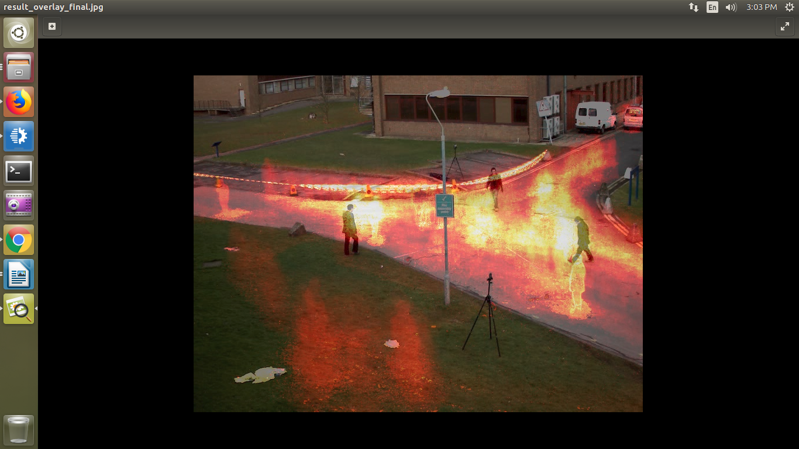
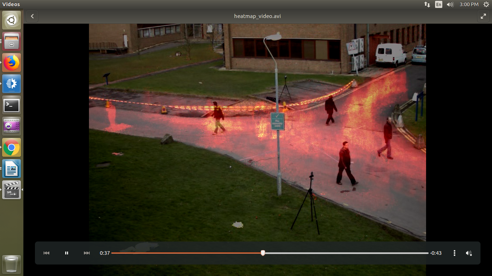

# Motion Heatmap

| Programming Language |  C++ |
| --- | --- |
| Skills (beg, intermediate, advanced) |  Intermediate |
| Time to complete project (in increments of 15 min) |   |
| Hardware needed (hardware used) | UP Squared* Grove IoT Development Kit, UVC compliant webcam |
| Target Operating System | Ubuntu* 16.04  |

## Introduction
This sample application is useful to see movement patterns over time.
For example, it could be used to see the usage of entrances to a factory floor over time, or patterns of shoppers in a store.

## What you’ll learn

-   Background subtraction
-   Application of a threshold
-   Accumulation of changed pixels over time
-   Add a color/heat map

## Gather your materials

-   UP Squared* board (http://www.up-board.org/upsquared/)
-   OpenVINO™
-   A UVC webcam
-   Intel® System Studio

## To Link OpenVINO™ libraries with Intel System Studio

To link the libraries to the project, click Project → Properties → C/C++ Build → Settings.

Select the libraries under Intel C++ linker.

Then add the required libraries and path for the libraries.

Click Apply and then click OK.

### Run the Application

There are two options for input:

 - Camera
 - Input video

Make sure you've plugged in a UVC webcam before attempting to run the application (if you are selecting camera input).

The output are heatmap\_video.avi and result\_overlay\_final.jpg and these are saved in the project folder.

The outputs are as shown below:

## How it works

The application takes each frame and first applies background subtraction using the createBackgroundSubtractorMOG2() object to create
a mask. A threshold is then applied to the mask to remove small amounts of movement, and also to set the accumulation value for each iteration. The result of the threshold is added to an accumulation image (one that starts out at all zero and gets added to each iteration without removing anything), which is what records the motion. At the very end, a color map is applied to the accumulated image so it's easier to see the motion. This colored imaged is then combined with a copy of the first frame using addWeighted() to accomplish the overlay.

The main APIs used are:

-   MOG background subtractor (createBackgroundSubtractorMOG2() -
    <https://docs.opencv.org/3.0-beta/doc/tutorials/video/background_subtraction/background_subtraction.html>

-   cvtColor() -
    <https://docs.opencv.org/2.4/modules/imgproc/doc/miscellaneous_transformations.html 

-   threshold() -
    <https://docs.opencv.org/2.4.13.4/doc/tutorials/imgproc/threshold/threshold.html>

-   applyColorMap() -
    <https://docs.opencv.org/2.4/modules/contrib/doc/facerec/colormaps.html>

-   addWeighted() -
    <https://docs.opencv.org/2.4/modules/core/doc/operations_on_arrays.html?highlight=compare>

